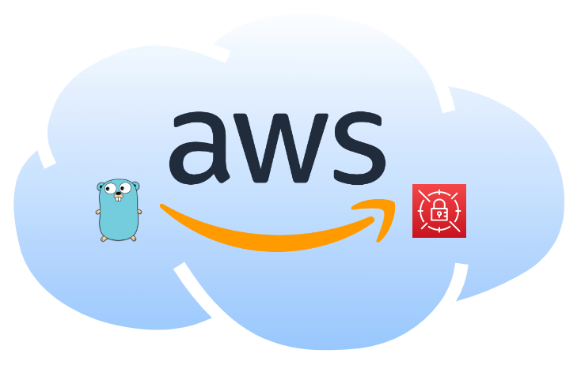

<hr>
<p align="center">
  
</p>
<h1 align="center">awsenvsec</h1>
<h4 align="center">Retrieve AWS Secrets as Environment Variables from Secrets Manager and/or Parameter Store</h4>
<div align="center">
<a href="">[](https://goreportcard.com/report/github.com/tenorwill/awsenvsec)</a>
<a href="">[](https://github.com/tenorwill/awsenvsec/actions/workflows/go.yaml)</a>
</div>
<hr>

## Summary
`awsenvsec` is a tool to decrypt AWS secrets and/or parameters from AWS Secrets Manager and Parameter Store for use as environment variables. There are two modes: default (no flags) and output. When output is selected, the results are formatted as JSON or ENV formats. When output is not used, exports are printed to the screen which can be evaluated (see Docker below). 


## How It Works
`awsenvsec` checks if the following ENV variables exist and uses them as default values. If they are not specified, they can be used later as flags:

```
AWS_REGION
SM_PATH
PS_PATH
```

If the Secrets Manager or Parameter Store paths are properly formatted, `awsenvsec` will retrieve and decrypt the values.

### Secrets Manager: JSON or Plaintext
Secrets Manager can store secrets as Key/Value pairs (formatted as JSON) or Plaintext. If the secret is a Key/Value pair, `awsenvsec` will loop through each pair individually. The suggested format for AWS Secrets Manager is something like this:

`product/dev/var`

### Parameter Store
Parameter Store variables can be used with the `-c` flag to retrieve variables recurisively. Example:

`/product/`

The above path would recursively retrieve all variables following the `/product/` path. The `-c` flag is not used (ignored) for Secrets Manager.

## Usage

`awsenvsec -h`:

```bash
Usage: ./bin/awsenvsec [-p profile] [-r region] [-sm smpath] [-ps pspath] [-c recursive] [-o output]

Flags:
  -p  | --profile         AWS Profile (Profile Name - Optional)
  -r  | --region          AWS Region (Default: us-east-1)
  -sm | --smpath          AWS Secrets Manager Path (example: "product/dev/var")
  -ps | --pspath          AWS Parameter Store Path (example: "/product/dev/var")
  -c  | --recursive       Recursive Flag (used if recursion is needed in Parameter Store)
  -o  | --output          Output to environment file (optional: must be either "env" or "json")

Example: ./bin/awsenvsec -p myprofile -r us-east-1 -sm "product/dev/var" -ps "/product/dev/var" -c -o json

```

### Build
```bash
go build -o bin/awsenvsec ./cmd/awsenvsec
```

### Examples
Use with the output flag, with both Secrets Manager and Parameter Store paths, output to `JSON`:

```bash
awsenvsec -sm "product/dev/var" -ps "/product/dev/var" -o json
```

Use with the output flag, but only use Parameter Store path, output to `ENV`:

```bash
awsenvsec -ps "/product/dev/var" -o env
```

Use with prepended environment variables:

```bash
AWS_REGION=us-west1 SM_PATH="product/dev/var" awsenvsec 
```

## Docker
A common use case for this program is to evaluate the result to securely provide encrypted environment variables in running Docker containers. A couple of options to make this easier:

### Dockerfile Environment Variables

In a Dockerfile, use the `SM_PATH` and/or `PS_PATH` variables:

```bash
FROM golang:1.18

WORKDIR /cmd/app

COPY . .

RUN wget https://github.com/tenorwill/awsenvsec/raw/master/bin/awsenvsec-linux-amd64 -O /bin/awsenvsec && \
  chmod +x /bin/awsenvsec
RUN go mod download
RUN go build -o app ./cmd/app

ENV SM_PATH product/dev/var
ENV PS_PATH /product/dev/var

...
EXPOSE 4000

CMD ["/bin/bash", "-c", "eval $(awsenvsec) && ./app"]

```

Run it:

```bash
docker run -it -p 4000:4000 app
```

### Inline Docker Environment Variables

I find the approach above a little easier, but the same below can be accomplished by presenting the `SM_PATH` or `PS_PATH` variables inline:

(same Dockerfile as above, removing the ENV variables)

Run it:

```bash
docker run -it -e SM_PATH="/product/dev/var" -e PS_PATH="/product/dev/var" -p 4000:4000 app
```

## Contribution
If you see something that can be improved, I'm all ears. Please submit a PR!
